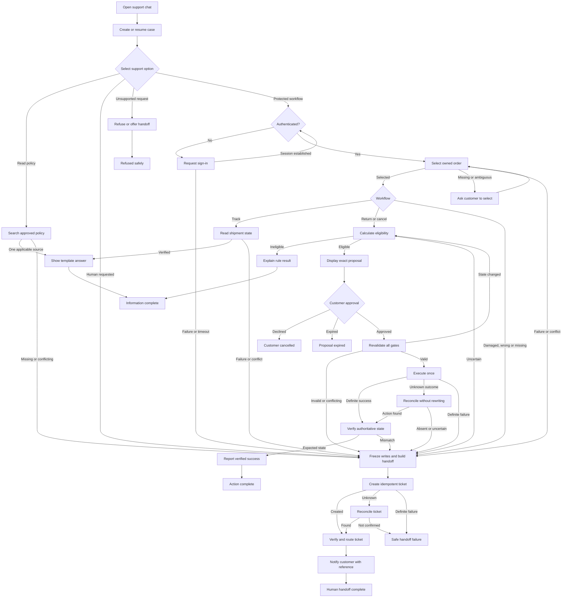

# Option A Architecture — Deterministic Baseline

## Status and recommendation

Option A is the first implementation and experimental control. It is a **deterministic guided self-service workflow implemented as an explicit finite-state machine**. It contains no LLM, semantic memory or model-selected tools.

The baseline is not throwaway code. Authentication, business rules, mock integrations, idempotency, confirmation, audit, escalation, test fixtures and evaluation cases are shared with Option E.

## Pattern recommended for this MVP stage

Use a **deterministic state machine with guided forms, fixed routing, versioned business rules and verified side effects**.

Customers select from:

- Track an order.
- Return an item.
- Cancel an order.
- Report a damaged, incorrect or missing item.
- Read delivery, return or cancellation policies.
- Speak to a human.

All transitions are explicit and allowlisted. No component may invent a transition or invoke an operation that is absent from the state definition.

## Pattern that may be justified next

Option E—a deterministic workflow containing bounded LLM steps—may be justified if the baseline demonstrates that guided menus, forms and keyword search materially fail on realistic customer language.

Option E may add:

- Free-text intent and entity extraction.
- Ambiguity detection and clarification drafting.
- Grounded policy explanations.
- Natural-language rendering of verified data.
- Draft escalation summaries.

Option E must not replace deterministic authentication, eligibility, confirmation, execution, idempotency, escalation, verification or audit controls.

## Evidence required before migrating to Option E

Migration requires evidence from the same labelled cases used to evaluate the baseline:

1. Customers frequently fail to select the correct guided workflow.
2. Keyword policy search has an unacceptable miss rate on paraphrased questions.
3. Multi-intent or ambiguous requests create excessive abandonment or escalation.
4. Option E materially improves task completion or correct routing on a held-out set.
5. Option E preserves 100% recall for mandatory escalation cases.
6. Option E introduces zero critical privacy, authorization or policy violations.
7. Option E produces zero duplicate state-changing actions.
8. Option E stays within the agreed latency and USD 0.05 average variable-cost ceiling.
9. Unsupported-claim and false-success rates remain at or below the baseline.
10. Every LLM-produced value remains non-authoritative until deterministically validated.

If the evidence is absent, Option A remains the preferred product architecture.

## Components and responsibilities

| Component | Responsibility |
|---|---|
| Guided chat interface | Display menu choices, forms, action previews, confirmations and fixed/template responses |
| Workflow controller | Own the current state and allowlisted transitions |
| Authentication gate | Validate the website session and bind the trusted customer identity |
| Policy catalogue | Return approved, versioned FAQ and policy content through keyword/conventional search |
| Order service | Return only orders owned by the authenticated customer |
| Shipment service | Return shipment events for a selected owned order |
| Eligibility engine | Apply deterministic return and cancellation rules |
| Action service | Create returns or cancel orders using exact approved parameters |
| Ticket service | Create, verify and route structured human-support tickets |
| State and idempotency store | Persist workflow state, proposals, confirmations and action keys |
| Audit and metrics | Record transitions, tool calls, outcomes, latency and operational metrics |

## Control invariants

1. Public policies are the only data accessible without authentication.
2. Protected queries derive customer identity from the trusted session.
3. An order ID must be selected from orders owned by that customer.
4. Eligibility is calculated by versioned deterministic rules.
5. A return or cancellation requires an immutable proposal and explicit customer approval.
6. Approval is bound to one action, target, parameter set and expiry time.
7. Authentication, ownership, source state and eligibility are revalidated before execution.
8. Every write uses an idempotency key.
9. An uncertain write is reconciled through readback and is never blindly repeated.
10. Success is reported only after authoritative verification.
11. Tool failure, missing evidence or conflicting evidence causes escalation.
12. Entering escalation invalidates pending proposals and revokes write capability.
13. Consequential actions are blocked if workflow state or mandatory audit persistence fails.

## Workflow diagram

## Complete transition catalogue

### Entry, menu and public knowledge

| ID | From | Condition | To | Transition behaviour |
|---|---|---|---|---|
| A01 | Chat opened | Request envelope is valid | Create/resume case | Generate correlation ID and append the initial event. |
| A02 | Chat opened | Request is malformed, oversized or rate-limited | Safe failure | Reject before any business-system access. |
| A03 | Create/resume case | State and audit persistence succeed | Main menu | Display allowlisted support choices. |
| A04 | Create/resume case | State or mandatory audit persistence fails | Safe failure | Stop; no protected read or write is permitted. |
| A05 | Main menu | Customer selects policy/FAQ | Policy selection | Display approved policy topics or accept a bounded keyword query. |
| A06 | Policy selection | One applicable approved source is found | Show answer | Render a fixed/template answer and record policy version. |
| A07 | Policy selection | No applicable source is found | Handoff | Do not improvise an answer. |
| A08 | Policy selection | Sources conflict or policy applicability is unclear | Handoff | Attach source identifiers and conflict reason. |
| A09 | Policy selection | Search dependency fails after one bounded read retry | Handoff | Record dependency failure. |
| A10 | Show answer | Delivery succeeds | Information complete | Record completion, latency and outcome. |
| A11 | Show answer | Delivery fails | Safe failure | Do not record the answer as delivered. |
| A12 | Main menu | Customer selects speak to human | Handoff | Invalidate any pending proposal. |
| A13 | Main menu | Customer selects an unsupported but harmless feature | Refusal | Explain scope and offer a human handoff. |
| A14 | Main menu | Customer selects refund, replacement or policy exception | Handoff | No prohibited execution capability is exposed. |

### Authentication and order selection

| ID | From | Condition | To | Transition behaviour |
|---|---|---|---|---|
| A15 | Main menu | Track, return, cancel or item-problem selected | Authentication gate | No protected tool is yet callable. |
| A16 | Authentication gate | Trusted session is valid | Bind customer and list orders | Bind signed subject to conversation. |
| A17 | Authentication gate | Customer is not signed in | Request sign-in | Show only the fixed first-party sign-in route. |
| A18 | Request sign-in | A valid session is established | Authentication gate | Validate server-side rather than trusting client text. |
| A19 | Request sign-in | Identity verification fails | Handoff | Include no protected order information. |
| A20 | Request sign-in | Session expires or customer abandons | Abandoned/expired | End without protected access. |
| A21 | Authentication gate | Session subject conflicts with case binding | Handoff | Record a security event; never silently rebind. |
| A22 | List orders | Owned orders are returned | Order selection | Present minimal order choices. |
| A23 | List orders | No owned order exists | Handoff | Do not reveal whether another customer's order exists. |
| A24 | List orders | Tool fails or returns conflicting ownership data | Handoff | Stop protected processing. |
| A25 | Order selection | Customer selects an order from the presented set | Load order | Validate selection against the owned-order set. |
| A26 | Order selection | Selection is missing or invalid | Order selection | Re-display choices with a bounded attempt count. |
| A27 | Order selection | Attempt limit is reached | Handoff | Prevent selection loops. |
| A28 | Load order | Order is current and ownership matches | Selected workflow | Continue to the chosen path. |
| A29 | Load order | Order is missing, stale or ownership conflicts | Handoff | Expose no unverified details. |

### Tracking

| ID | From | Condition | To | Transition behaviour |
|---|---|---|---|---|
| A30 | Selected workflow | Track order selected | Read shipment | Query the selected owned order only. |
| A31 | Read shipment | Current consistent events are returned | Show status | Render verified status and timestamps using templates. |
| A32 | Read shipment | Order and carrier states conflict | Handoff | Attach both states to the ticket. |
| A33 | Read shipment | Tool fails after bounded read retry | Handoff | Never substitute an old or assumed status. |
| A34 | Show status | Delivery succeeds | Information complete | Record the verified source state. |

### Return and cancellation eligibility

| ID | From | Condition | To | Transition behaviour |
|---|---|---|---|---|
| A35 | Selected workflow | Return selected | Return eligibility | Apply deterministic versioned rules. |
| A36 | Selected workflow | Cancellation selected | Cancellation eligibility | Read fresh fulfilment state and apply deterministic rules. |
| A37 | Eligibility | Eligible | Create proposal | Persist exact target, parameters, rule version and expiry. |
| A38 | Eligibility | Ineligible with complete evidence | Explain ineligibility | Show fixed reason and applicable policy. |
| A39 | Explain ineligibility | Customer accepts | Information complete | Perform no business write. |
| A40 | Explain ineligibility | Customer disputes or requests exception | Handoff | Preserve rule output for human review. |
| A41 | Eligibility | Facts are missing, stale or conflicting | Handoff | Do not choose eligible or ineligible. |
| A42 | Eligibility | Rules service fails | Handoff | Do not replace policy with ad hoc judgement. |

### Proposal, approval and execution

| ID | From | Condition | To | Transition behaviour |
|---|---|---|---|---|
| A43 | Create proposal | Proposal persists successfully | Display proposal | Show order, item, quantity, action and expiry. |
| A44 | Create proposal | Proposal cannot be persisted exactly | Safe failure | Do not request or accept approval. |
| A45 | Display proposal | Customer explicitly approves | Revalidation | Store action-bound confirmation. |
| A46 | Display proposal | Customer declines | Customer cancelled | Invalidate proposal; no write occurs. |
| A47 | Display proposal | Proposal expires or customer becomes inactive | Proposal expired | Invalidate proposal and confirmation. |
| A48 | Display proposal | Customer changes target/parameters | Eligibility | Invalidate old proposal and recalculate. |
| A49 | Revalidation | Session, ownership, rule version and eligibility remain valid | Execute once | Create/reuse idempotency key. |
| A50 | Revalidation | Source state changed but can be reevaluated | Eligibility | Require a new proposal and approval. |
| A51 | Revalidation | Authentication, ownership or evidence is invalid | Handoff | Perform no write. |
| A52 | Execute once | Idempotency record shows completed action | Verification | Do not execute again. |
| A53 | Execute once | No action exists and request is valid | Invoke exact write | Send one allowlisted operation with fixed parameters. |
| A54 | Execute once | Write returns definite success | Verification | Treat response as provisional until readback. |
| A55 | Execute once | Write returns definite failure/rejection | Handoff | Do not alter parameters and retry. |
| A56 | Execute once | Timeout leaves outcome unknown | Reconciliation | Never repeat the write blindly. |
| A57 | Reconciliation | Readback finds intended action | Verification | Link result to idempotency record. |
| A58 | Reconciliation | Readback proves no action or remains uncertain | Handoff | Mark outcome uncertain. |
| A59 | Verification | Authoritative state matches proposal | Report success | Persist verified outcome and reference. |
| A60 | Verification | State mismatches or verification fails | Handoff | Do not report success. |
| A61 | Report success | Message delivered | Action complete | Close automated workflow. |
| A62 | Report success | Delivery fails | Action complete with communication failure | Business action remains complete; never repeat it. |

### Item problems and escalation

| ID | From | Condition | To | Transition behaviour |
|---|---|---|---|---|
| A63 | Selected workflow | Damaged, incorrect or missing item selected | Collect structured facts | Ask only predefined, minimum questions. |
| A64 | Collect structured facts | Required fields supplied | Handoff | Do not issue refund or replacement. |
| A65 | Collect structured facts | Customer requests human or stops responding | Handoff or abandoned | Create ticket with available verified facts only when handoff is requested/required. |
| A66 | Any active state | Mandatory escalation condition occurs | Freeze writes | Invalidate proposals and revoke action capability. |
| A67 | Freeze writes | Evidence is available | Build ticket payload | Use deterministic schema and templates. |
| A68 | Build ticket payload | Validation and redaction succeed | Create ticket | Use idempotency/correlation key. |
| A69 | Create ticket | Definite success | Verify ticket | Store returned ticket ID. |
| A70 | Create ticket | Definite pre-commit failure | Create ticket | Retry once with the same key. |
| A71 | Create ticket | Timeout makes outcome unknown | Reconcile ticket | Query by idempotency/correlation key. |
| A72 | Reconcile ticket | Matching ticket exists | Verify ticket | Do not create another ticket. |
| A73 | Reconcile ticket | No ticket can be confirmed | Safe handoff failure | Do not claim escalation succeeded. |
| A74 | Verify ticket | Required fields and general queue are confirmed | Notify customer | Provide verified ticket reference. |
| A75 | Verify ticket | Ticket is incomplete and safely correctable | Update allowed fields | Preserve audit history, then verify again. |
| A76 | Verify ticket | Ticket remains invalid/unavailable | Safe handoff failure | Raise an operational alert. |
| A77 | Notify customer | Delivery succeeds | Human handoff complete | Automated writes remain revoked. |
| A78 | Notify customer | Delivery fails | Handoff complete with communication failure | Ticket remains valid; no duplicate ticket. |

## Termination conditions

| Terminal state | Entry condition | Side effects allowed | Resume rule |
|---|---|---|---|
| Information complete | Verified policy/order/shipment answer delivered or ineligibility accepted | Audit and metrics only | A new request starts from the menu |
| Action complete | Return/cancellation is authoritatively verified | One verified business action plus audit | New action requires fresh state and approval |
| Customer cancelled | Customer declined proposal | No business action | New request may start immediately |
| Proposal expired | Approval window or session expired | No business action | Re-run authentication, eligibility and proposal |
| Human handoff complete | Ticket and queue receipt verified | Ticket and audit records only | Continuation is human-owned |
| Refused safely | Unsupported non-mandatory request refused | Communication and audit only | Customer may choose an in-scope option |
| Abandoned/expired | Customer inactive or sign-in expires | Pending proposal invalidated | Fresh session/workflow required |
| Safe failure | Required state, audit or handoff system cannot be trusted | Minimum safe failure event only | Manual retry after recovery |
| Action complete with communication failure | Write verified but response undelivered | Completed action remains authoritative | Status may be re-read; action may not be repeated |
| Handoff complete with communication failure | Ticket verified but notification undelivered | Ticket remains authoritative | Reference may be resent; ticket may not be duplicated |

## Failure paths

| Failure | Detection | Recovery | Prohibited response |
|---|---|---|---|
| Invalid menu/form value | Schema and allowlist validation | Re-display valid choices; bounded attempts | Guessing user intent |
| Policy search miss | No approved source | Handoff | Improvised policy answer |
| Policy conflict | Multiple inconsistent applicable sources | Handoff with source references | Selecting a policy silently |
| Authentication failure | Trusted auth result | Handoff with no protected data | Order lookup |
| Session/customer mismatch | Subject and case-binding comparison | Security event and handoff | Silent rebinding |
| Order ownership failure | Server-side row authorization | Handoff | Revealing record existence/details |
| Read timeout | Typed timeout | One bounded retry, then handoff | Treating absence as fact |
| Rule-engine failure | Typed deterministic error | Handoff | Manual rule improvisation by the application |
| Confirmation ambiguity | Fixed confirmation control | Ask again or expire | Inferring consent |
| Stale proposal | Version/expiry/state mismatch | Invalidate and recalculate | Executing old proposal |
| Duplicate write | Unique idempotency record | Verify existing action | New key and repeat write |
| Write timeout | Unknown outcome | Read-only reconciliation | Blind write retry |
| Verification mismatch | Expected/actual comparison | Handoff | Success message |
| Ticket timeout | Unknown outcome | Reconcile by idempotency key | Immediate duplicate ticket |
| Ticket service unavailable | Retry/reconcile fails | Safe handoff failure and operational alert | Claiming handoff succeeded |
| State persistence failure | Transaction failure | Stop | Continuing consequential workflow |
| Audit failure | Mandatory event cannot persist | Stop before write | Unaudited action |
| Customer disconnect after write | Missing delivery acknowledgement | Preserve completed action and allow status read | Repeating action |
| Application crash | Durable state and idempotency records | Resume from last committed state; reconcile uncertain writes | Replaying the workflow from the beginning |

## Evaluation role

Option A establishes:

- The correctness ceiling for deterministic policy and action handling.
- The minimum acceptable safety and audit behaviour.
- Baseline task-completion and escalation rates.
- Baseline latency and non-model operating cost.
- A reusable corpus of successes, abandonments, search misses and human handoffs.

Option E is justified only if it improves natural-language usability against this baseline while preserving these invariants.
