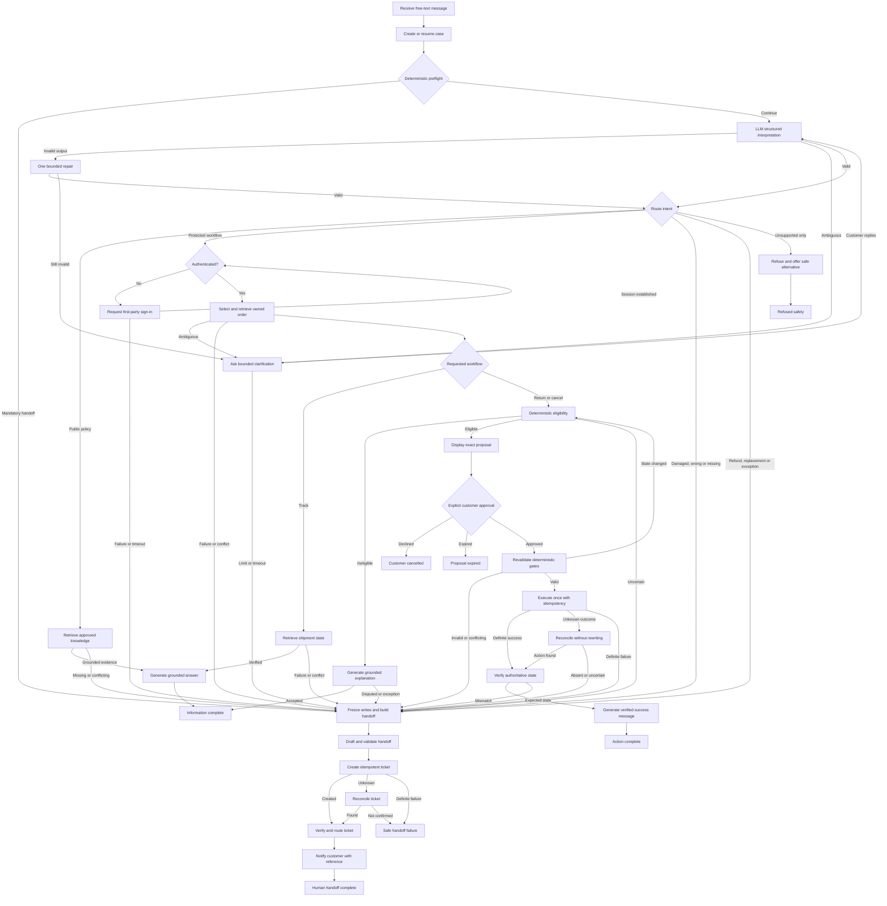

# Option E Architecture — Deterministic Workflow with Bounded LLM Steps

## Status and recommendation

Option E is the recommended AI-enhanced MVP pattern after the Option A baseline is complete. It is a **deterministic, auditable state machine containing bounded LLM interpretation and communication nodes**.

It is not a general tool-calling agent. The workflow determines which state can call which capability. The LLM cannot create tools, alter permissions, skip gates or decide the success of an external action.

## MVP pattern

Use a **guarded workflow with deterministic control, bounded LLM steps and human approval for consequential writes**.

### LLM responsibilities

- Interpret free-text intent.
- Extract non-authoritative entities.
- Detect ambiguity.
- Draft minimal clarification questions.
- Retrieve and explain relevant public policy information.
- Render verified order and shipment facts in customer-friendly language.
- Draft structured escalation summaries.

### Deterministic responsibilities

- Authentication and authorization.
- Capability allowlisting.
- Customer/order ownership checks.
- Policy-version selection.
- Return and cancellation eligibility.
- Mandatory escalation triggers.
- Approval binding and expiry.
- Idempotency and write execution.
- Post-action reconciliation and verification.
- Workflow state, audit and termination.

### Autonomy posture

- Level 4: approved public knowledge reads and aggregate telemetry only.
- Level 3: scoped protected reads, conversation operations, grounded communications, ticket creation and safe escalation.
- Level 2: customer-approved return/cancellation; human-approved specialist routing and retention deletion.
- Level 1: ticket category/priority suggestions.
- Level 0: refunds, replacements, policy exceptions, customer/profile changes, payments, additional channels, device control, long-term preference memory and adverse account decisions.

## Pattern that might be justified later

A **supervisor-worker pattern within the same deterministic safety perimeter** may be justified if the product expands into independent support domains.

Potential workers could include:

- Order and delivery investigation.
- Returns and cancellations.
- Payments and billing.
- Product assistance.
- Fraud/risk triage.
- Customer communication.

The supervisor may route and combine work, but a central deterministic gateway must continue to own identity, permissions, business rules, approvals, writes, verification and final termination.

A supervisor-worker design must not be introduced merely to make the portfolio appear more agentic.

## Evidence required before migration

Migration from Option E requires:

1. Several genuinely independent domains with different tools, data or permissions.
2. A material share of cases requiring cross-domain or parallel investigation.
3. Evidence that the single workflow has become difficult to maintain, not merely large.
4. Specialist workers outperforming Option E on the same held-out cases.
5. No reduction from 100% mandatory-escalation recall.
6. Zero critical privacy, authorization or policy violations.
7. Zero duplicate state-changing actions.
8. Low contradictory-worker, context-loss and delegation-loop rates.
9. End-to-end traces that attribute every claim, decision and tool call.
10. Latency and cost remaining inside approved limits, or an explicit stakeholder decision to revise them.
11. Clear human ownership for each specialist domain and its policies.

Absent that evidence, the deterministic Option E graph remains the preferred architecture.

## Components and trust boundaries

| Component | Trust level and responsibility |
|---|---|
| Chat interface | Untrusted customer input; displays streamed text, structured choices and fixed approval controls |
| Workflow controller | Authoritative owner of state, transitions, capability grants and terminal states |
| Preflight guard | Deterministically detects explicit handoff requests, prohibited capabilities and known mandatory conditions |
| LLM interpreter | Untrusted structured suggestion for intent, entities, ambiguity and risk signals |
| Knowledge retrieval | Read-only access to approved, versioned public knowledge sources |
| Authentication/authorization | Authoritative identity, session and ownership enforcement outside the LLM |
| Order/shipment tools | Scoped Level 3 reads using trusted customer and selected owned order IDs |
| Eligibility engine | Authoritative deterministic rules and policy versioning |
| Proposal/approval service | Immutable proposal, exact preview, action-bound confirmation and expiry |
| Action executor | Level 2 return/cancellation execution with idempotency and exact parameters |
| Reconciler/verifier | Read-only determination of uncertain and post-write outcomes |
| Ticket/handoff service | Level 3 general escalation; specialist routing remains Level 2 |
| Conversation/state store | Active case context only; no long-term preference memory |
| Audit/evaluation | Transition, tool, evidence, outcome, latency and cost records |

## Control invariants

1. LLM output is always treated as untrusted structured input.
2. The LLM never determines authentication, ownership, eligibility or action success.
3. Protected tools are not present in the capability set before authentication.
4. Customer identity comes from the trusted session, never extracted text.
5. Order IDs must be validated against the authenticated customer's owned-order set.
6. Retrieved content cannot modify system instructions or capability policy.
7. Missing or conflicting evidence produces escalation, not model judgement.
8. A return/cancellation requires an immutable proposal and explicit affected-customer approval.
9. Approval is bound to exact parameters and expires.
10. Authentication, state and eligibility are revalidated immediately before execution.
11. Every write uses an idempotency key.
12. Unknown write outcomes are reconciled without another write.
13. Success is reported only after authoritative verification.
14. Escalation is terminal for automated writes and invalidates pending proposals.
15. Mandatory state/audit persistence failure blocks consequential operations.
16. Conversation memory is case-scoped; no cross-session preference memory exists.

## Workflow diagram

## Complete transition catalogue

### Entry and deterministic preflight

| ID | From | Condition | To | Transition behaviour |
|---|---|---|---|---|
| E01 | Message received | Envelope and session reference are valid | Create/resume case | Create correlation ID, append message and load only case-scoped context. |
| E02 | Message received | Malformed, oversized or rate-limited request | Safe failure | Reject before model or business-tool access. |
| E03 | Create/resume case | State and mandatory audit persist | Preflight | Continue. |
| E04 | Create/resume case | State or audit persistence fails | Safe failure | Stop; no protected read/write. |
| E05 | Preflight | Customer explicitly requests a human | Handoff | Invalidate proposals and freeze writes. |
| E06 | Preflight | Explicit refund, replacement or policy-exception request | Handoff | No prohibited capability is exposed. |
| E07 | Preflight | Explicit fraud, threat, legal or safety signal | Handoff | Use a neutral high-risk-review reason; take no adverse action. |
| E08 | Preflight | Prompt injection or capability-escalation attempt | Refuse or continue valid intent | Ignore injected instructions and preserve capability policy. |
| E09 | Preflight | No mandatory condition | LLM interpretation | Supply only case-scoped minimum context. |

### LLM interpretation and clarification

| ID | From | Condition | To | Transition behaviour |
|---|---|---|---|---|
| E10 | LLM interpretation | Output satisfies schema and routing evidence requirements | Route intent | Store values as model-derived suggestions. |
| E11 | LLM interpretation | Output is syntactically invalid | Repair once | Return only schema error and reduced context. |
| E12 | Repair once | Output becomes valid | Route intent | Continue normally. |
| E13 | Repair once | Output remains invalid or model fails | Clarification or handoff | Use fixed clarification when possible; otherwise handoff. |
| E14 | LLM interpretation | Intent/entity ambiguity is explicit | Clarification | Ask one minimum-necessary question. |
| E15 | Clarification | Customer supplies relevant information | LLM interpretation | Append answer and reinterpret. |
| E16 | Clarification | Customer requests human | Handoff | Stop automated investigation. |
| E17 | Clarification | Question/turn limit reached | Handoff | Prevent loops. |
| E18 | Clarification | Customer inactive or session expires | Abandoned/expired | Invalidate pending proposal. |

### Routing

| ID | From | Condition | To | Transition behaviour |
|---|---|---|---|---|
| E19 | Route intent | General delivery/return/cancellation policy | Knowledge retrieval | Only approved public sources are callable. |
| E20 | Route intent | Order status, shipment, return or cancellation | Authentication gate | Protected tools remain disabled until success. |
| E21 | Route intent | Damaged, incorrect or missing item | Handoff | Gather only allowable facts; no refund/replacement action. |
| E22 | Route intent | Refund, replacement or exception | Handoff | Explain that human review is required without promising outcome. |
| E23 | Route intent | Unsupported harmless request | Refusal | Explain scope and offer safe alternative/human review. |
| E24 | Route intent | Several supported intents | Clarification | Ask which issue to handle first; never run writes concurrently. |
| E25 | Route intent | Unrecognized after clarification | Handoff | Do not guess a workflow. |

### Knowledge and grounded response

| ID | From | Condition | To | Transition behaviour |
|---|---|---|---|---|
| E26 | Knowledge retrieval | Applicable, consistent approved sources found | Grounded generation | Provide retrieved passages and metadata only. |
| E27 | Knowledge retrieval | No applicable source | Handoff | Do not answer from model memory. |
| E28 | Knowledge retrieval | Sources conflict or applicability is unclear | Handoff | Attach conflicting sources. |
| E29 | Knowledge retrieval | Read dependency fails after bounded retry | Handoff | Record tool failure. |
| E30 | Grounded generation | Output is supported by sources and passes policy checks | Deliver answer | Store source links/versions in trace. |
| E31 | Grounded generation | Unsupported claim or contradiction detected | Repair once | Regenerate from structured evidence only. |
| E32 | Grounded generation | Repair fails | Handoff | Do not send questionable answer. |
| E33 | Deliver answer | Delivery succeeds | Information complete | Record outcome, latency and cost. |
| E34 | Deliver answer | Delivery fails | Safe failure | Do not mark delivered. |

### Authentication and order selection

| ID | From | Condition | To | Transition behaviour |
|---|---|---|---|---|
| E35 | Authentication gate | Trusted session valid | Bind customer/list orders | Identity comes from signed session, not extracted entity. |
| E36 | Authentication gate | Not signed in | Request sign-in | Use fixed first-party route; collect no credentials in chat. |
| E37 | Request sign-in | Valid session established | Authentication gate | Validate server-side. |
| E38 | Request sign-in | Verification fails | Handoff | Include no protected data. |
| E39 | Request sign-in | Session expires/customer abandons | Abandoned/expired | End protected workflow. |
| E40 | Authentication gate | Session subject conflicts with case binding | Handoff | Record security condition; never silently rebind. |
| E41 | List orders | Owned orders returned | Select order | Present minimal choices or validate extracted order reference. |
| E42 | List orders | No order matches | Clarification | Do not reveal existence of other accounts' orders. |
| E43 | List orders | Tool/ownership evidence fails or conflicts | Handoff | Stop protected processing. |
| E44 | Select order | Extracted/selected order is in owned set | Load order | Store authoritative order ID. |
| E45 | Select order | Several owned orders match | Clarification | Ask customer to choose from owned orders. |
| E46 | Select order | Attempt limit reached | Handoff | Prevent loops. |
| E47 | Load order | Ownership and current record verified | Requested workflow | Continue. |
| E48 | Load order | Missing, stale or inconsistent record | Handoff | Do not expose or infer details. |

### Tracking

| ID | From | Condition | To | Transition behaviour |
|---|---|---|---|---|
| E49 | Requested workflow | Tracking/status intent | Read shipment | Query selected owned order only. |
| E50 | Read shipment | Current consistent events returned | Verified response generation | Pass allowlisted facts and timestamps. |
| E51 | Read shipment | Order and carrier conflict | Handoff | Attach both states. |
| E52 | Read shipment | Tool fails after bounded retry | Handoff | Never substitute assumed status. |
| E53 | Verified response generation | Output matches structured evidence | Deliver answer | Send customer-friendly verified status. |
| E54 | Verified response generation | Output adds or contradicts facts | Repair once or template fallback | Prefer deterministic template if repair fails. |

### Return and cancellation eligibility

| ID | From | Condition | To | Transition behaviour |
|---|---|---|---|---|
| E55 | Requested workflow | Return intent | Return eligibility | Apply deterministic versioned rules. |
| E56 | Requested workflow | Cancellation intent | Cancellation eligibility | Read fresh fulfilment state and apply deterministic rules. |
| E57 | Eligibility | Eligible | Proposal | Persist exact target, parameters, policy/rule version and expiry. |
| E58 | Eligibility | Ineligible with complete evidence | Grounded explanation | LLM may explain but cannot alter decision. |
| E59 | Grounded explanation | Explanation matches rule result and customer accepts | Information complete | No write. |
| E60 | Grounded explanation | Customer disputes or requests exception | Handoff | Preserve rule evidence. |
| E61 | Eligibility | Missing, stale or conflicting facts | Handoff | Do not infer eligibility. |
| E62 | Eligibility | Rules dependency fails | Handoff | LLM cannot substitute a decision. |

### Proposal and approval

| ID | From | Condition | To | Transition behaviour |
|---|---|---|---|---|
| E63 | Proposal | Proposal persists | Display exact action | UI fields come from immutable proposal, not generated prose. |
| E64 | Proposal | Persistence/display consistency fails | Safe failure | Do not request approval. |
| E65 | Display exact action | Customer uses explicit approve control or valid action-bound approval | Revalidation | Store authenticated approval event. |
| E66 | Display exact action | Customer declines | Customer cancelled | Invalidate proposal. |
| E67 | Display exact action | Natural-language response is ambiguous | Fixed confirmation prompt | Do not infer consent. |
| E68 | Display exact action | Proposal expires/customer inactive | Proposal expired | Invalidate approval and proposal. |
| E69 | Display exact action | Customer modifies target/parameters | Eligibility | Invalidate old proposal and reevaluate. |
| E70 | Display exact action | Customer requests human | Handoff | Revoke write capability. |

### Revalidation, execution, reconciliation and verification

| ID | From | Condition | To | Transition behaviour |
|---|---|---|---|---|
| E71 | Revalidation | Session, ownership, rule version, state and eligibility valid | Execute once | Create/reuse idempotency key. |
| E72 | Revalidation | Underlying state changed but can be reevaluated | Eligibility | Explain change; require new proposal/approval. |
| E73 | Revalidation | Session expired | Sign-in or handoff | Old approval cannot survive reauthentication. |
| E74 | Revalidation | Ownership/evidence/eligibility invalid or conflicting | Handoff | No business write. |
| E75 | Execute once | Idempotency record shows completed action | Verification | Do not execute again. |
| E76 | Execute once | No prior action and request valid | Invoke exact write | One allowlisted operation with fixed parameters. |
| E77 | Execute once | Definite success | Verification | Treat response as provisional. |
| E78 | Execute once | Definite rejection/failure | Handoff | Do not vary parameters and retry. |
| E79 | Execute once | Timeout/connection loss makes outcome unknown | Reconciliation | Never repeat write. |
| E80 | Reconciliation | Readback finds intended action | Verification | Link result to original key. |
| E81 | Reconciliation | Readback proves no action or remains uncertain | Handoff | Mark uncertain outcome. |
| E82 | Verification | Authoritative state matches proposal | Verified success generation | Persist verified outcome/reference. |
| E83 | Verification | Partial/mismatched state or verifier failure | Handoff | Do not report success. |
| E84 | Verified success generation | Message matches verified state | Deliver success | Use operation/reference ID. |
| E85 | Verified success generation | Generated message contradicts/adds facts | Deterministic template fallback | Do not delay or alter completed action. |
| E86 | Deliver success | Delivery succeeds | Action complete | Close automated workflow. |
| E87 | Deliver success | Delivery fails | Action complete with communication failure | Never repeat action; allow later status-only recovery. |

### Escalation and handoff

| ID | From | Condition | To | Transition behaviour |
|---|---|---|---|---|
| E88 | Any active state | Mandatory escalation fires | Freeze writes | Invalidate proposals and remove write capabilities. |
| E89 | Freeze writes | Verified evidence available | Draft handoff | Supply minimum case context and provenance. |
| E90 | Draft handoff | LLM summary passes schema, grounding and redaction | Create ticket | Mark narrative AI-generated. |
| E91 | Draft handoff | Summary fails validation or model unavailable | Deterministic handoff template | Escalation must not depend on generation. |
| E92 | Deterministic handoff template | Required fields assembled | Create ticket | Include facts only. |
| E93 | Create ticket | Definite success | Verify ticket | Store ticket ID. |
| E94 | Create ticket | Definite pre-commit failure | Create ticket | Retry once with same idempotency key. |
| E95 | Create ticket | Timeout makes outcome unknown | Reconcile ticket | Query by idempotency/correlation key only. |
| E96 | Reconcile ticket | Matching ticket found | Verify ticket | Do not create another. |
| E97 | Reconcile ticket | Ticket cannot be confirmed | Safe handoff failure | Do not claim handoff. |
| E98 | Verify ticket | Required fields and general queue confirmed | Route/notify | Continue. |
| E99 | Verify ticket | Correctable field omission | Update allowlisted fields | Preserve version history, then verify. |
| E100 | Verify ticket | Ticket remains invalid/unavailable | Safe handoff failure | Raise operational alert. |
| E101 | Route/notify | General support case | Notify customer | Provide verified reference. |
| E102 | Route/notify | Specialist routing suggested | General queue plus human approval | Ticket priority/category remains suggestion; specialist routing is Level 2. |
| E103 | Notify customer | Delivery succeeds | Human handoff complete | Automated writes remain revoked. |
| E104 | Notify customer | Delivery fails | Handoff complete with communication failure | Ticket remains; no duplicate creation. |

## Termination conditions

| Terminal state | Entry condition | External state permitted | Resume rule |
|---|---|---|---|
| Information complete | Grounded policy/status answer delivered or ineligibility accepted | Read, conversation, audit and metrics records | New message begins a new intent cycle |
| Action complete | Return/cancellation authoritatively verified and success delivered | One verified business action plus audit | New action requires fresh evidence/proposal/approval |
| Customer cancelled | Customer declined proposal | No business write | New request may start immediately |
| Proposal expired | Confirmation/session window expired | No business write; proposal invalid | Fresh authentication, eligibility and proposal required |
| Human handoff complete | Ticket, required fields and queue receipt verified | Ticket and audit records only | Human-owned continuation; automated writes remain revoked |
| Refused safely | Unsupported request refused and mandatory escalation not required | Communication/audit only | Customer may submit in-scope request |
| Abandoned/expired | Customer inactivity/session expiry while awaiting input | Pending proposal invalidated | Fresh case/session required |
| Safe failure | State, audit, security or handoff infrastructure cannot be trusted | Minimum failure/audit event only | Manual retry after recovery |
| Action complete with communication failure | Write verified but response undelivered | Completed action remains authoritative | Resend status only; never repeat write |
| Handoff complete with communication failure | Ticket verified but notification failed | Ticket remains authoritative | Resend reference only; never duplicate ticket |

## Failure paths

| Failure | Detection | Permitted recovery | Prohibited behaviour |
|---|---|---|---|
| Invalid LLM structure | Schema validation | One repair attempt, then fixed clarification/template/handoff | Parsing guesses or partial execution |
| Low-confidence or ambiguous interpretation | Evidence/confidence and required-field rules | Minimum clarification; bounded turns | Choosing the most consequential interpretation |
| Prompt injection | Input/content policy and capability gateway | Ignore instruction; continue valid intent or refuse | Adding tools, changing system policy or revealing secrets |
| Retrieved-content injection | Content treated as data, not instructions | Strip/ignore instructions; use approved passages | Executing instructions found in knowledge documents |
| Unsupported generated claim | Output-to-evidence validation | Repair once or deterministic template | Sending ungrounded claim |
| Model unavailable/timeout | Typed provider failure | Deterministic Option A-style fallback or handoff | Skipping safety controls |
| Knowledge miss | No approved source | Handoff | Answering from parametric memory |
| Policy conflict | Multiple inconsistent applicable versions | Handoff with sources | Silent policy choice |
| Authentication failure | Trusted auth result | Bounded sign-in retry then handoff | Protected read |
| Session/customer mismatch | Subject/case-binding comparison | Security event and handoff | Silent rebind |
| Cross-customer order selection | Ownership validation | Reject and handoff | Revealing record existence/details |
| Read-tool timeout | Typed timeout | One bounded idempotent read retry | Treating missing result as fact |
| Eligibility-engine failure | Typed deterministic error | Handoff | LLM eligibility decision |
| Confirmation ambiguity | Approval validator | Fixed prompt or expiry | Inferring consent |
| Stale proposal | Expiry/source-version mismatch | Invalidate and recalculate | Executing old approval |
| Duplicate action request | Unique idempotency record | Verify prior action | New key and duplicate write |
| Write timeout | Unknown-outcome state | Read-only reconciliation | Blind retry |
| Verification mismatch | Expected/actual comparison | Handoff | False success response |
| Ticket timeout | Unknown outcome | Reconcile by idempotency key | Duplicate ticket |
| Ticket system unavailable | Retry/reconcile fails | Safe handoff failure and alert | Claiming human handoff |
| Conversation isolation failure | Session/customer mismatch | Stop and raise security failure | Continue with mixed context |
| State persistence failure | Transaction failure | Stop | Consequential action |
| Mandatory audit failure | Audit event cannot persist | Stop before protected write | Unaudited write |
| Latency budget exceeded | Workflow timer | Explain delay; deterministic template or handoff | Dropping auth, eligibility or verification |
| Cost budget approached | Per-case usage meter | Stop further LLM calls; template fallback or handoff | Trading safety for lower cost |
| Customer disconnect after write | Missing delivery acknowledgement | Preserve verified outcome; status-only resume | Repeat action |
| Application crash | Durable state and idempotency record | Resume last committed state; reconcile uncertain writes | Replay from start |

## Migration boundary

The later supervisor-worker pattern must reuse, not replace:

- The deterministic capability gateway.
- Authentication and ownership enforcement.
- Eligibility engines.
- Proposal and approval binding.
- Idempotent action services.
- Reconciliation and verification.
- Mandatory escalation rules.
- Terminal-state enforcement.
- Audit and evaluation contracts.

Only interpretation, investigation and evidence assembly are candidates for delegation. Final operational authority remains centralized and deterministic.
